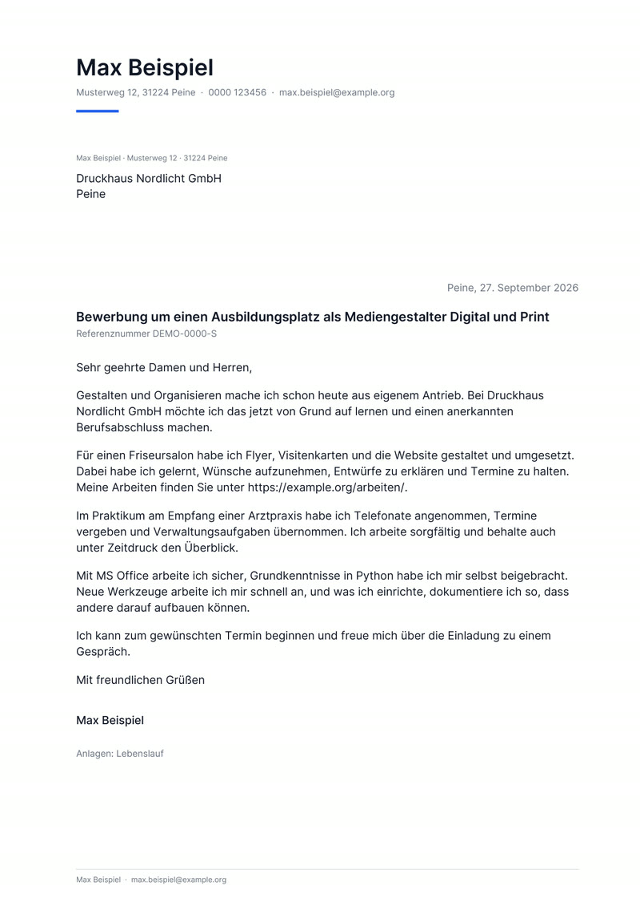

# bewerbungsagent

Findet passende Stellen in der Jobbörse der Bundesagentur für Arbeit, schreibt Anschreiben als PDF und verschickt sie **erst, wenn ein Mensch wörtlich `SENDEN` tippt** – an die Firmen und mit einem Bewerbungsnachweis an die zuständige Stelle.

Läuft komplett lokal. Keine Cloud, kein Konto, kein Abo. Die Texte schreibt wahlweise ein lokales Modell (LM Studio, Ollama), ein OpenAI-kompatibler Dienst, das eigene Claude-Abo über `claude -p` – oder ein Agent wie Claude Code oder Hermes über den eingebauten MCP-Server.

```
Suchen ──► Filtern ──► Bewerten ──► Anschreiben ──► PDF ──► Prüfen in der App ──► SENDEN ──► Bewerbungsnachweis
 BA-API     Regeln     Heuristik     Modell oder      fpdf2    Editor + Vorschau     SMTP        PDF-Tabelle + alle
 v6/v4      Sperrfrist + Modell      MCP-Agent                                                   Anschreiben
                                                          └──────────── Obsidian-Notiz je Stelle, Git-Commit ────────────┘
```


<p align="center"></p>

*Beide Bilder zeigen eine Vorführung mit erfundenen Daten – `python scripts/demo.py --app` legt sie an und startet die Oberfläche auf Port 8767.*

## Was es kann

| | |
|---|---|
| **Suche** | Öffentliche Jobsuche-API (`pc/v6/jobs`, `pc/v4/jobdetails`), Umkreis, Zeitraum, mehrere Suchbegriffe |
| **Filter** | Ausschlusswörter, Zeitarbeit, Minijobs, Voll-/Teilzeit, Firma schon angeschrieben (Sperrfrist), Mindestpassung |
| **Kontakt** | Bewerbungsadresse und Ansprechpartner aus dem Anzeigentext, auch verschleiert (`jobs (at) firma [dot] de`) |
| **Anschreiben** | Modell liefert nur Betreff und Absätze. Anrede nach DIN 5008, Grußformel und Adressen setzt der Code. Automatische Prüfung auf Platzhalter, Floskeln, Länge |
| **PDF** | Einseitig auf DIN-5008-Raster, Schrift schrumpft stufenweise statt auf Seite 2 zu laufen, meldet echten Überlauf |
| **Versand** | Nur nach getipptem `SENDEN`. `.eml`-Kopie jeder Mail, Historie gegen Doppelbewerbungen |
| **Oberfläche** | Lokale Web-App: Läufe, Editor, PDF-Vorschau, Entfernen mit Nachrücken, Verlauf mit Rückmeldungen |
| **Von Hand** | Stelle aus einem anderen Portal anlegen, gefundene Adresse eintragen, einzeln senden; Portal-Bewerbungen mit PDF-Download und „als beworben markieren“ |
| **Bewerbungsweg** | Erkennt, wenn eine Adresse nur für Rückfragen dasteht, Mail-Bewerbungen ausgeschlossen sind oder ein Portal verlangt wird – dann kein automatischer Versand |
| **Ausbildung** | Suche nach Ausbildungsplätzen, Beginn und geforderter Schulabschluss aus der API, eigene Regeln im Anschreiben |
| **Agenten** | MCP-Server mit 10 Werkzeugen – **ohne** Sende-Werkzeug |
| **Wissensspeicher** | Eine Obsidian-Notiz je Stelle plus Übersicht, eigene Notizen bleiben beim Neuschreiben erhalten |

## Schnellstart (Windows)

```bat
Bewerbungsagent starten.bat
```

Legt beim ersten Start `.venv` an, prüft die Einrichtung und öffnet `http://127.0.0.1:8765`.

Von Hand:

```bash
python -m venv .venv
.venv\Scripts\python -m pip install -e ".[mcp,dev]"
copy profil.example.md profil\profil.md       # Abschluss, Erfahrung, Ziele, Suchbegriffe
copy config.example.yaml config.yaml
copy .env.example .env                        # SMTP-Zugang, z. B. Gmail-App-Passwort
.venv\Scripts\python -m bewerbungsagent status
```

## Befehle

| Befehl | Zweck |
|---|---|
| `python -m bewerbungsagent app` | Oberfläche |
| `python -m bewerbungsagent suchen` | Trockenlauf: nur suchen und filtern, nichts speichern |
| `python -m bewerbungsagent lauf` | Neuer Lauf im Terminal |
| `python -m bewerbungsagent senden <lauf-id>` | Versand mit Rückfrage im Terminal |
| `python -m bewerbungsagent mcp` | MCP-Server über stdio |
| `python -m bewerbungsagent status` | Einrichtung prüfen |
| `python scripts/demo.py --app` | Vorführung mit erfundenen Daten auf Port 8767 |
| `python scripts/test_smtp.py` | lokaler Mail-Auffangserver für Probeläufe, stellt nichts zu |

Beispielausgabe von `suchen` (erfundene Daten):

```
7 mit E-Mail (automatisch bewerbbar), 18 ohne

   62  @  Sachbearbeiter (m/w/d) Wareneingang               Beispiel Logistik GmbH       Musterstadt            2 km
   57  @  Mitarbeiter IT-Support                            Muster IT GmbH               Wolfenbüttel    26 km
   54     Lagerhelfer (m/w/d)                               Garagenbau Muster GmbH       Adelheidsdorf   30 km
```

## An einen Agenten anbinden

Der MCP-Server bietet `profil_zeigen`, `lauf_starten`, `laeufe_auflisten`, `lauf_zeigen`, `anschreiben_regeln`, `anschreiben_setzen`, `stelle_entfernen`, `stelle_hinzufuegen`, `stelle_uebernehmen`, `versand_pruefen`. Ein Agent kann also suchen, lesen und schreiben – aber nicht senden. Eine präparierte Stellenanzeige kann ihn deshalb auch nicht zum Verschicken bringen.

**Claude Code** – `.mcp.json` im Projektordner:

```json
{
  "mcpServers": {
    "bewerbungsagent": {
      "command": "C:/Pfad/zu/bewerbungsagent/.venv/Scripts/python.exe",
      "args": ["-m", "bewerbungsagent", "mcp"],
      "env": { "BEWERBUNGSAGENT_WURZEL": "C:/Pfad/zu/bewerbungsagent" }
    }
  }
}
```

**Hermes Agent** – `~/.hermes/config.yaml`:

```yaml
mcp_servers:
  bewerbungsagent:
    command: "C:/Pfad/zu/bewerbungsagent/.venv/Scripts/python.exe"
    args: ["-m", "bewerbungsagent", "mcp"]
```

Ohne eigenes Modell `llm.backend: keins` setzen. Der Lauf legt dann nur die Stellen an, der Agent schreibt die Texte über `anschreiben_setzen`.

## Sicherheit

- Die App lauscht nur auf `127.0.0.1`. Jeder API-Aufruf braucht ein Token, das bei jedem Start neu erzeugt wird und nur in der ausgelieferten Seite steht. Der `Host`-Header muss lokal sein (gegen DNS-Rebinding).
- Senden verlangt das Wort `SENDEN`, in der App wie im Terminal. `senden` im Terminal verweigert, wenn stdin keine Konsole ist.
- `profil/`, `config.yaml`, `.env` und `daten/` stehen in `.gitignore`.

## Was es bewusst nicht tut

- **Keine Captchas lösen.** Auf arbeitsagentur.de liegen Kontaktdaten hinter einem Captcha. Stellen ohne Adresse im Anzeigentext landen in der Liste „Selbst bewerben“ mit Link zur Anzeige.
- **Keine Portale bedienen.** Bewerbungsformulare von Firmen füllt es nicht aus.
- **Nichts erfinden.** Das Modell bekommt nur das Profil als Faktenbasis, und die Prüfung markiert verdächtige Stellen im Text – lesen muss man trotzdem.

## Tests

```bash
.venv\Scripts\python -m pytest
```

61 Tests, ohne Netz und ohne Modell. Der Ende-zu-Ende-Test schickt echte SMTP-Mails an einen lokalen `aiosmtpd`-Server und prüft Empfänger, BCC und Anhänge. `scripts/test_smtp.py` startet denselben Auffangserver für einen Probelauf von Hand.

## Aufbau

```
bewerbungsagent/
  quellen/arbeitsagentur.py   API-Client, Anzeige -> Stelle
  kontakt.py                  E-Mail und Ansprechpartner aus Freitext
  bewertung.py                Regeln, Heuristik, Modellbewertung
  anschreiben.py              Prompt, Prüfung, Rahmen
  pdf.py                      Brief und Nachweis
  mail.py                     Nachrichten und SMTP
  dienst.py                   der Ablauf, von CLI, App und MCP genutzt
  vault.py                    Obsidian-Notizen und Git-Commit
  app.py + statisch/          Web-Oberfläche, nur Standardbibliothek
  mcp_server.py               MCP-Werkzeuge
```

## Lizenz

MIT
